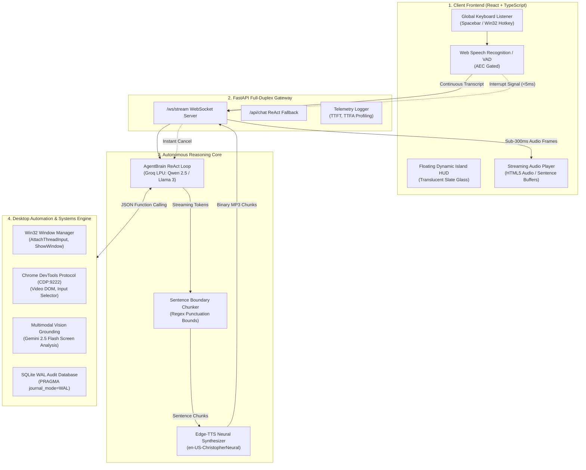

# 🎙️ ApexCore: Autonomous Voice Agent with Desktop Automation

> **Production-Grade, Full-Duplex Voice AI Agent & Operating System Automation Engine**  
> Engineered with an asynchronous event-driven loop in Python (FastAPI + WebSockets), React + TypeScript floating Dynamic HUD, native Win32 window management, and Chrome DevTools Protocol (CDP) in-tab execution.

[](https://www.python.org/downloads/)
[](https://fastapi.tiangolo.com/)
[](https://react.dev/)
[](https://www.typescriptlang.org/)
[](https://opensource.org/licenses/MIT)
[]()

---

## 📌 Executive Summary

**ApexCore** is an enterprise-grade autonomous voice agent and desktop automation pipeline built to replace fragile, blocking CLI assistants with an ultra-low latency, full-duplex conversational interface. 

Instead of treating desktop automation as macro coordinate clicking or ungrounded script execution, ApexCore combines **four synergistic layers**:
1. **Low-Latency Streaming Pipeline:** Full-duplex WebSocket architecture with sentence-chunked Edge-TTS synthesis and client-side instant interruption (barge-in in $<5\text{ms}$).
2. **Deterministic OS & Window Control:** Win32 API thread input attachment (`AttachThreadInput`), direct window foregrounding, and non-duplicate process reuse (e.g. smart Calculator handling).
3. **In-Tab Web Execution (CDP):** Bi-directional Chrome DevTools Protocol integration over port 9222 allowing direct HTML5 video playback control, search input manipulation, and DOM element clicking.
4. **Multimodal Screen Grounding:** Vision-driven screen inspection and $(x, y)$ coordinate localization powered by Gemini Vision for human-like visual grounding.

---

## 🏗️ Architectural Topology



---

## ⚡ Core Engineering Highlights

### 1. Sub-300ms Time-to-First-Audio (TTFA)
Rather than waiting for the LLM to complete its entire response before initiating audio synthesis, tokens are piped into an adaptive `SentenceChunker`. The moment the first clause finishes, audio synthesis triggers concurrently over WebSockets while subsequent sentences are being generated.

### 2. Full-Duplex Barge-In & Instant Cancellation
When the user vocalizes during assistant playback:
- Audio playback halts instantly ($<5\text{ms}$).
- An interrupt frame (`{"type": "interrupt"}`) cancels ongoing server-side generation tasks.
- Conversational state reconciles cleanly without memory corruption or truncated replay.

### 3. Window State Awareness & Process Reuse
- Solves the common macro failure where typing commands leak into background windows.
- Resolves windows by title keywords, verifies `GetForegroundWindow()`, and calls Win32 `AttachThreadInput` to guarantee target focus.
- **Smart Instance Reuse:** Reuses existing application windows (such as `Calculator`) instead of spawning duplicate processes, clearing prior input with `Escape` before typing.

### 4. Mathematical Operator Speech Normalization
Natural language vocalization for mathematical symbols: converts expressions like `20 * 10 = 200` into *"20 times 10 equals 200"* before passing through TTS sanitization, preventing stripped tokens and robotic readout.

### 5. In-Tab Chrome Control via CDP (Chrome DevTools Protocol)
- Direct WebSocket communication on port 9222 executing in-tab JavaScript directly in the DOM.
- Enables *"Pause the video"*, *"Play the video"*, *"Mute"*, or *"Click the first result"* without brittle coordinate estimation, with automatic fallback to Windows media keys.

### 6. Minimalist, Production-Grade Floating HUD
- Non-black, non-white titanium slate studio aesthetic (`#1c202a` / `#212632`) with frosted translucent glass (`backdrop-filter: blur(28px)`).
- On-demand vitals inspection: metrics are queried **strictly when requested**, eliminating token drain and periodic polling overhead.

---

## 📂 Project Structure

```text
ApexCore/
├── api/
│   ├── app.py                     # FastAPI server, REST routes & Full-Duplex WebSockets
│   └── __init__.py
├── core/
│   ├── config.py                  # Environment config, audio constants, model selection
│   ├── state.py                   # Multi-turn conversation state & interrupt handling
│   └── telemetry.py               # Latency profiler (TTFT, TTFA, STT, Turn profiling)
├── database/
│   ├── db.py                      # SQLite WAL engine & parameterized queries
│   └── schema.sql                 # Audit logs, telemetry records & metrics tables
├── frontend/                      # React 19 + TypeScript Dynamic HUD
│   ├── src/
│   │   ├── App.tsx                # Main floating island, audio queue & hotkeys
│   │   ├── App.css                # Minimalist titanium slate studio theme
│   │   ├── index.css              # Typography & system design tokens
│   │   └── main.tsx               # Client entry point
│   ├── package.json               # Node dependencies & Vite scripts
│   └── vite.config.ts             # Vite configuration
├── pipeline/
│   ├── chunker.py                 # Adaptive punctuation sentence boundary chunker
│   └── orchestrator.py            # Local audio cascade loop (sounddevice + VAD)
├── services/
│   ├── brain.py                   # Autonomous ReAct agent loop with Groq LPU
│   ├── stt.py                     # Whisper Large v3 Turbo transcription
│   ├── tts.py                     # Edge-TTS WebSocket audio synthesis & math cleaner
│   └── vad.py                     # Silero VAD v5 ONNX neural state machine
├── tests/
│   ├── test_api.py                # API & tool endpoint validation
│   ├── test_db.py                 # SQLite WAL transaction tests
│   ├── test_os_tools.py           # Window discovery, CDP, and OS tool tests
│   └── test_sentence_chunker.py   # Sentence boundary streaming tests
├── tools/
│   ├── cdp_controller.py          # Chrome DevTools Protocol client (port 9222)
│   ├── db_tools.py                # Safe read-only SQLite interrogation
│   ├── file_tools.py              # Launchers, folders, URLs, calculator typing
│   ├── schemas.py                 # OpenAI/Groq function calling JSON schemas
│   ├── system_tools.py            # psutil OS metrics & process enumeration
│   ├── vision_grounding.py        # Gemini 2.5 Flash screen analysis & coordinates
│   ├── window_manager.py          # Win32 foregrounding & AttachThreadInput
│   └── __init__.py                # Tool registry and dispatcher
├── main.py                        # Backend application entry point (uvicorn)
├── requirements.txt               # Backend Python dependencies
└── tray_agent.py                  # Windows system tray companion (Ctrl+Shift+Space)
```

---

## 🛠️ Tool Capabilities & Schemas

| Tool Name | Scope | Description |
| :--- | :--- | :--- |
| `focus_window` | Desktop GUI | Brings any open desktop window into immediate foreground focus using Win32 API. |
| `desktop_type_or_calculate` | Desktop GUI | Reuses existing Calculator instance, clears previous calculation, types expression, and computes numeric answer. |
| `control_chrome_tab_video` | In-Tab Web | Controls HTML5 video elements inside Chrome (`pause`, `play`, `mute`, `toggle`) via CDP with native media key fallback. |
| `click_chrome_element` | In-Tab Web | Detects and clicks top search results or exact DOM selectors in Chrome. |
| `search_web_or_play` | Web / YouTube | Searches YouTube, Google, or Wikipedia, automatically resolving and launching direct video watch streams. |
| `open_folder_or_path` | File System | Locates and opens user folders across Desktop, Documents, Downloads, and OneDrive in Windows Explorer. |
| `open_application` | OS Apps | Launches any installed desktop software (VS Code, Chrome, WhatsApp, Spotify, Calculator, etc.). |
| `capture_and_analyze_screen` | Multimodal Vision | Captures monitor view and provides natural visual analysis via Gemini 2.5 Flash. |
| `click_on_visual_target` | Multimodal Vision | Locates target UI element coordinates $(x, y)$ on screen using Vision AI and triggers mouse click. |
| `get_system_vitals` | OS Diagnostics | On-demand CPU, RAM, Disk C free space, and battery performance reporting. |
| `get_top_processes` | OS Diagnostics | Enumerates top memory- or CPU-consuming Windows processes. |
| `query_local_db` | SQLite WAL | Read-only SQL queries against conversation audit logs. |

---

## 🚀 Getting Started

### 1. Prerequisites
- **Operating System:** Windows 10/11 (for native Win32 window management & automation)
- **Python:** 3.11+
- **Node.js:** 18+

### 2. Environment Setup

Clone the repository and install backend dependencies:
```powershell
git clone https://github.com/Nikil-R/Autonomous-Voice-Agent-with-Desktop-Automation.git
cd Autonomous-Voice-Agent-with-Desktop-Automation
pip install -r requirements.txt
```

Install frontend dependencies:
```powershell
cd frontend
npm install
cd ..
```

### 3. Configure API Credentials
Create a `.env` file in the root directory:
```env
GROQ_API_KEY=gsk_your_groq_api_key_here
GEMINI_API_KEY=AIzaSy_your_gemini_api_key_here
```

---

## 💻 Running the Application

### Option A: Standard Development Mode (Recommended)

**Terminal 1 — FastAPI Backend (Auto-reloading):**
```powershell
uvicorn main:app --reload
```

**Terminal 2 — React TypeScript HUD:**
```powershell
cd frontend
npm run dev
```

Open your browser to `http://localhost:5173` to see the floating HUD. Press <kbd>SPACE</kbd> or click the status icon to activate conversational voice automation.

### Option B: System Tray Companion
To run ApexCore as a persistent background Windows notification tray app with a global hotkey:
```powershell
python tray_agent.py
```
*Press <kbd>Ctrl</kbd> + <kbd>Shift</kbd> + <kbd>Space</kbd> anywhere in Windows to toggle the floating HUD.*

---

## 🧪 Verification & Automated Testing

ApexCore includes an automated test suite verifying SQLite WAL concurrency, OS tool dispatching, and sentence streaming bounds:

```powershell
# Run backend test suite
python -m pytest -v tests/

# Verify frontend build & TypeScript compliance
cd frontend
npm run build
```

---

## 🎙️ Example Voice Commands to Try

| Category | Example Voice Prompt | Agent Action |
| :--- | :--- | :--- |
| **Desktop Calculation** | *"Calculate 20 times 10"* | Brings existing Calculator to front, clears previous entries, types `20*10=`, and speaks: *"Calculated 20 times 10 equals 200 in Calculator, Sir."* |
| **Window Switching** | *"Bring Chrome to the front"* | Locates active Chrome window and brings it to foreground using Win32 API. |
| **Media Playback** | *"Play Jailer 2 song on YouTube"* | Scrapes and opens the top video directly in Chrome. |
| **In-Tab Video Control** | *"Pause the video"* | Dispatches CDP video control to pause active HTML5 playback. |
| **Screen Inspection** | *"What is currently on my screen?"* | Takes a high-speed screenshot and analyzes active windows via Gemini 2.5 Flash. |
| **Folder Access** | *"Open my Studies folder"* | Searches Desktop and Documents to launch folder in Windows Explorer. |
| **On-Demand Vitals** | *"Check my CPU usage and free RAM"* | Queries live hardware metrics and reports status concisely. |

---

## 🛡️ Architecture & Security Considerations

- **SQL Injection Prevention:** The `query_local_db` tool rejects non-`SELECT` statements and enforces read-only access.
- **Path Traversal Guards:** File scanning tools validate target roots against allowed user directory boundaries.
- **Acoustic Echo Cancellation (AEC) Gating:** The voice recognition pipeline dynamically increases silence probability thresholds during assistant speech playback to prevent self-interruption loops.
- **Zero Heavy Abstraction Overheads:** Pure Python `asyncio` execution path eliminates 200–400ms framework wrapping latency.

---

## 📄 License
This project is licensed under the [MIT License](LICENSE).
