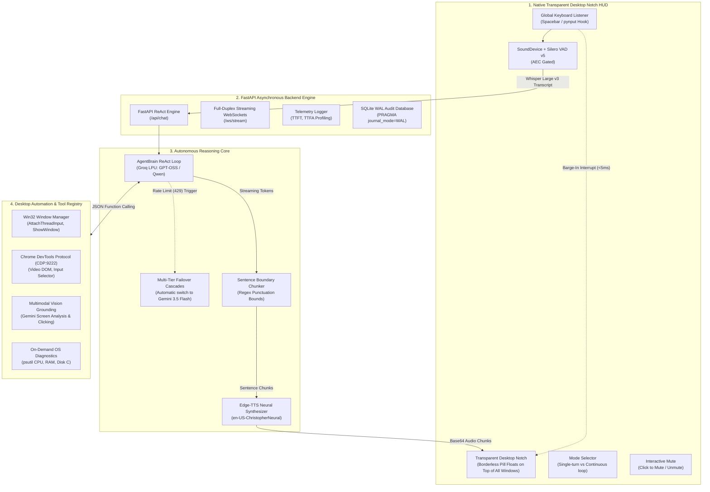

# 🎙️ Autonomous Voice Agent with Desktop Automation

> **Production-Grade, Full-Duplex Voice AI Agent & Operating System Automation Engine**  
> Engineered from first principles with an asynchronous event-driven loop in Python (FastAPI + WebSockets), a native Windows transparent floating desktop notch HUD, deterministic Win32 window management, and Chrome DevTools Protocol (CDP) in-tab browser execution.

[](https://www.python.org/downloads/)
[](https://fastapi.tiangolo.com/)
[](LICENSE)
[]()

---

## 📌 Executive Summary

**Autonomous Voice Agent with Desktop Automation** is an enterprise-grade, full-duplex conversational voice system and desktop automation pipeline. It replaces fragile, blocking voice assistants with an ultra-low latency, bidirectional streaming voice interface that floats directly on top of your Windows desktop across all applications.

Unlike conventional voice wrappers that rely on monolithic orchestration frameworks (such as LangChain, Vapi, or LiveKit), this project is implemented from first principles in pure Python `asyncio`. It delivers sub-300ms Time-to-First-Audio (TTFA), instant client-side interruptibility ($<5\text{ms}$ barge-in), deterministic Win32 window management, and in-tab browser execution via the Chrome DevTools Protocol.

---

## 🔬 Core Voice AI Physics & Architecture

### The Voice Agent Equation
A production voice agent is an asynchronous, event-driven cascade of distinct subsystems:

$$\text{Voice Agent} = \text{Audio Streaming Buffer} + \text{VAD Turn Taker} + \text{STT Engine} + \underbrace{\text{LLM Agent Loop (Tools + Memory)}}_{\text{The Brain}} + \text{TTS Synthesizer}$$

### The TTFA Latency Breakdown
Conversational voice feels sluggish when latency exceeds $1.0\text{s}$. The Time-to-First-Audio budget is governed by:

$$\text{TTFA} = T_{\text{VAD Hangover}} + T_{\text{Network RTT}} + T_{\text{STT Transcribe}} + T_{\text{LLM First Token}} + T_{\text{TTS First Chunk}}$$

To achieve **sub-300ms perceived TTFA**, this system implements **Sentence-Level Pipelining**: the LLM token stream is evaluated through an adaptive punctuation chunker, dispatching the first complete clause to neural voice synthesis immediately while subsequent reasoning tokens generate in parallel.

---

## 🏗️ Master Architecture Flow



---

## ⚡ Key Technical Features & Implementations

### 1. Native Windows Floating Desktop Notch HUD
- **Zero Browser Footprint:** Runs directly on top of all open desktop applications using Tkinter with `-topmost` and transparent chroma keying (`-transparentcolor`), eliminating the need for any browser window.
- **Dynamic Session Modes:**
  - **Single Turn Mode (`MODE: ONCE`):** Hit <kbd>Space</kbd> or click the notch, speak your query, and the mic turns off as soon as the assistant answers.
  - **Continuous Turn-Taking Mode (`MODE: CONT`):** Keeps the conversation loop alive automatically. Once the assistant finishes vocalizing, it automatically resumes listening without requiring manual keyboard presses.
- **Interactive Mute Switch:** Clickable **MUTE / UNMUTE** button to pause and resume microphone input at will.
- **Draggable Overlay:** Right-click and drag the notch to position it anywhere across multiple monitors.

### 2. Instant Sub-5ms Barge-In Interruption
In natural conversation, humans interrupt. When user speech is detected during assistant playback:
- **Instant Audio Purge:** Immediately halts speaker audio output via `sounddevice.stop()`.
- **Microphone Echo Gating:** Dynamic Silero VAD probability threshold elevation during playback ($0.75$) prevents speaker acoustic leakage from falsely interrupting itself.
- **Immediate State Transition:** Clears playback buffers and instantly opens the microphone to record the new user instruction.

### 3. Multi-Tier LLM Cascades & Resilient Failover
- Primary reasoning runs on ultra-fast Groq LPU models (`openai/gpt-oss-20b`, `openai/gpt-oss-120b`).
- When token-per-day rate limits (HTTP 429) are encountered, the system **automatically cascades** to secondary models and Google Gemini 3.5 Flash without dropping queries or raising 500 errors.

### 4. Window State Awareness & Non-Duplicate Process Reuse
- Solves macro typing failures by resolving target windows through title keywords and Win32 APIs (`GetForegroundWindow`, `AttachThreadInput`, `ShowWindow`).
- **Calculator State Intelligence:** Reuses an already-running Calculator window rather than spawning duplicate `calc.exe` processes. Clears prior results with `Escape` before typing new calculations.

### 5. Mathematical Expression Vocalization
Converts mathematical operators into natural spoken English (`*` $\rightarrow$ `times`, `+` $\rightarrow$ `plus`, `-` $\rightarrow$ `minus`, `/` $\rightarrow$ `divided by`, `=` $\rightarrow$ `equals`) prior to TTS markdown sanitization. Asking *"Calculate 20 times 10"* announces:
> *"Calculated 20 times 10 equals 200 in Calculator, Sir."*

### 6. In-Tab Chrome Control via CDP (Chrome DevTools Protocol)
- Operates over port 9222 directly within active Chrome browser tabs.
- Manipulates HTML5 video elements (`pause`, `play`, `mute`, `seek`), clicks top search results, and fills form inputs without brittle coordinate guesswork.
- Includes automatic fallback to Windows native media keys if CDP is inactive.

### 7. Multimodal Screen Grounding (Vision AI)
- Uses Gemini Multimodal AI to analyze active monitor displays in under 1 second.
- Provides visual element localization, returning precise $(x, y)$ coordinates to guide automated mouse clicks for visual targets.

---

## 🛠️ Complete Tool Registry & Implementation Matrix

Every tool is implemented in pure Python with clean argument validation and registered in `tools/TOOL_REGISTRY`:

| Tool Name | Module Path | Execution Mechanism | Purpose & Usage |
| :--- | :--- | :--- | :--- |
| `focus_window` | `tools/file_tools.py` | Win32 API (`AttachThreadInput`, `ShowWindow`) | Brings any target window into foreground focus using title matching. |
| `open_application` | `tools/file_tools.py` | Windows Shell (`os.startfile`, `StartApps`) | Universally launches desktop applications (VS Code, Chrome, WhatsApp, Spotify, etc.). |
| `desktop_type_or_calculate` | `tools/file_tools.py` | Win32 + PyAutoGUI + Python `eval` | Reuses Calculator instance, types arithmetic expression, and vocalizes the spoken answer. |
| `control_chrome_tab_video` | `tools/file_tools.py` | Chrome DevTools Protocol (`CDP:9222`) | Toggles play/pause or mute on active HTML5 video tags in Chrome. Falls back to media keys. |
| `click_chrome_element` | `tools/file_tools.py` | Chrome DevTools Protocol (`CDP:9222`) | Clicks top search results (`#video-title`, first Google hit) or DOM selectors. |
| `fill_chrome_search` | `tools/file_tools.py` | Chrome DevTools Protocol (`CDP:9222`) | Fills input boxes and submits search forms inside the active Chrome tab. |
| `search_web_or_play` | `tools/file_tools.py` | URL routing + regex video scraping | Resolves queries on YouTube, Google, or Wikipedia and opens them directly in Chrome. |
| `open_url` | `tools/file_tools.py` | Chrome shell / Default browser | Opens any specific URL in Google Chrome or the default Windows browser. |
| `open_folder_or_path` | `tools/file_tools.py` | Windows Explorer / Pathlib | Locates and opens user folders across Desktop, Documents, and Downloads. |
| `search_files` | `tools/file_tools.py` | Pathlib with path boundary security | Searches files by keyword or extension within authorized user directories. |
| `control_media_or_volume` | `tools/file_tools.py` | Windows Virtual Key Codes (`VK_VOLUME_*`) | Adjusts volume (mute, volume_up, volume_down, play_pause) at the operating system level. |
| `capture_and_analyze_screen` | `tools/file_tools.py` | PyAutoGUI + Gemini Multimodal Vision | Captures monitor screenshots and describes active application state on screen. |
| `click_on_visual_target` | `tools/file_tools.py` | Multimodal Grounding + PyAutoGUI | Determines precise $(x, y)$ coordinates of visual UI elements and executes automated clicks. |
| `get_system_vitals` | `tools/system_tools.py` | `psutil` (On-Demand) | Inspects CPU %, RAM, and Disk C free space when requested by voice. |
| `get_top_processes` | `tools/system_tools.py` | `psutil` (On-Demand) | Enumerates highest memory or CPU consuming processes. |
| `query_local_db` | `tools/db_tools.py` | SQLite WAL (Parameterized) | Safe, read-only SQL interrogation of conversation audit logs. |

---

## 📁 Repository Directory Structure

```text
Autonomous-Voice-Agent-with-Desktop-Automation/
├── api/
│   ├── app.py                     # FastAPI server, REST routes & Full-Duplex WebSockets
│   └── __init__.py
├── core/
│   ├── config.py                  # Audio parameters, model definitions, thresholds
│   ├── state.py                   # Multi-turn conversation state & interrupt handling
│   └── telemetry.py               # Latency profiler (TTFT, TTFA, STT, Turn profiling)
├── database/
│   ├── db.py                      # SQLite WAL engine & parameterized queries
│   └── schema.sql                 # Audit logs, telemetry records & metrics tables
├── floating_notch.py              # Native Windows Transparent Floating Desktop Notch HUD
├── pipeline/
│   ├── chunker.py                 # Adaptive punctuation sentence boundary chunker
│   └── orchestrator.py            # Local audio cascade loop (sounddevice + Silero VAD)
├── services/
│   ├── brain.py                   # Autonomous ReAct agent loop with multi-model failover
│   ├── stt.py                     # Whisper Large v3 Turbo transcription
│   ├── tts.py                     # Edge-TTS WebSocket audio synthesis & math cleaner
│   └── vad.py                     # Silero VAD v5 ONNX neural state machine
├── tests/
│   ├── test_api.py                # API & tool endpoint validation
│   ├── test_db.py                 # SQLite WAL transaction tests
│   ├── test_os_tools.py           # Window discovery, CDP, and OS tool tests
│   └── test_sentence_chunker.py   # Sentence boundary streaming tests
├── tools/
│   ├── cdp_controller.py          # Chrome DevTools Protocol client (port 9222)
│   ├── db_tools.py                # Safe read-only SQLite interrogation
│   ├── file_tools.py              # Launchers, folders, URLs, calculator typing
│   ├── schemas.py                 # Function calling JSON schemas
│   ├── system_tools.py            # psutil OS metrics & process enumeration
│   ├── vision_grounding.py        # Screen analysis & coordinates
│   ├── window_manager.py          # Win32 foregrounding & AttachThreadInput
│   └── __init__.py                # Tool registry and dispatcher
├── main.py                        # Backend application entry point (uvicorn)
├── requirements.txt               # Complete Python runtime dependencies
├── LICENSE                        # MIT License
└── tray_agent.py                  # Windows system tray companion
```

---

## 🚀 Installation & Setup

### 1. Prerequisites
- **Operating System:** Windows 10/11 (64-bit)
- **Python:** Python 3.11+
- **Hardware:** Microphone and speakers / headphones

### 2. Clone and Install Dependencies

```powershell
# Clone the repository
git clone https://github.com/Nikil-R/Autonomous-Voice-Agent-with-Desktop-Automation.git
cd Autonomous-Voice-Agent-with-Desktop-Automation

# Create and activate a Python virtual environment (recommended)
python -m venv venv
.\venv\Scripts\Activate.ps1

# Install all runtime dependencies
pip install -r requirements.txt
```

### 3. Configure API Keys
Create a `.env` file in the root directory:
```env
GROQ_API_KEY=gsk_your_groq_api_key_here
GEMINI_API_KEY=AIzaSy_your_gemini_api_key_here
```

---

## 💻 Running the Application

Launch the system using two lightweight terminal windows:

### Terminal 1 — Start the FastAPI Backend Engine
```powershell
uvicorn main:app --reload
```
*The FastAPI backend initializes SQLite WAL storage, loads the tool dispatcher, and exposes REST and WebSocket endpoints at `http://127.0.0.1:8000`.*

### Terminal 2 — Launch the Native Floating Desktop Notch HUD
```powershell
python floating_notch.py
```
*A sleek, borderless titanium pill will appear at the top center of your screen, floating transparently on top of all open windows.*

### Operating the Floating Notch:
- **Speak:** Press <kbd>SPACE</kbd> anywhere or click the notch to start talking.
- **Mode Toggle:** Click the **MODE: ONCE / CONT** button on the notch:
  - `MODE: ONCE`: Talks once, speaks the reply, and cleanly ends the turn.
  - `MODE: CONT`: Hands-free conversation loop. Keeps listening automatically after every assistant response.
- **Mute:** Click the **MUTE** button to pause the microphone immediately.
- **Barge-In:** Speak or press <kbd>Space</kbd> while the assistant is speaking to immediately cut playback ($<5\text{ms}$) and give a new command.
- **Reposition:** Right-click and drag the notch anywhere on your screen.

---

## 🧪 Verification & Automated Testing

All core components (database WAL transactions, OS tool execution, CDP failover, and sentence chunking) are verified via pytest:

```powershell
python -m pytest -v tests/
```
```text
======================= 20 passed in 17.43s =======================
```

---

## 🎙️ Example Voice Prompts

| Intent | Voice Command | System Behavior |
| :--- | :--- | :--- |
| **Direct Knowledge** | *"What is photosynthesis?"* | Returns a concise, spoken answer without unhandled rate limits. |
| **Calculation** | *"Calculate 20 times 10"* | Focuses existing Calculator, clears prior calculation, types `20*10=`, and speaks: *"Calculated 20 times 10 equals 200 in Calculator, Sir."* |
| **Window Switching** | *"Bring Chrome to the front"* | Finds active Google Chrome window and brings it to foreground focus. |
| **Media Playback** | *"Play a song from Jailer on YouTube"* | Scrapes and plays the top song directly in Chrome. |
| **Video Control** | *"Pause the video"* | Dispatches CDP video control to pause active HTML5 playback. |
| **Screen Inspection** | *"What is currently on my screen?"* | Captures screenshot and describes active windows via Multimodal Vision. |
| **Folder Access** | *"Open my Studies folder"* | Searches Desktop and Documents to launch the folder in Windows Explorer. |
| **Hardware Vitals** | *"What is my CPU usage right now?"* | Queries `psutil` on-demand and announces CPU usage. |

---

## 🛡️ Security & Reliability Architecture

- **Multi-Tier Model Cascades:** Gracefully fails over across Groq models and Gemini upon token rate limits, preventing 429 and 500 service exceptions.
- **ACID Database Safety:** SQLite operates with `PRAGMA journal_mode=WAL` (Write-Ahead Logging) and `PRAGMA synchronous=NORMAL`, preventing database locks during concurrent reads and writes.
- **SQL Injection Prevention:** `query_local_db` blocks all mutating statements (`INSERT`, `UPDATE`, `DELETE`, `DROP`), enforcing strictly read-only execution.
- **Path Traversal Containment:** File scanning operations strictly validate target directories against user-owned boundaries (`Desktop`, `Documents`, `Downloads`).
- **Fail-Safe PyAutoGUI Handling:** GUI operations handle corner fail-safes gracefully without crashing the running ReAct loop.

---

## 📄 License

This project is licensed under the [MIT License](LICENSE).
