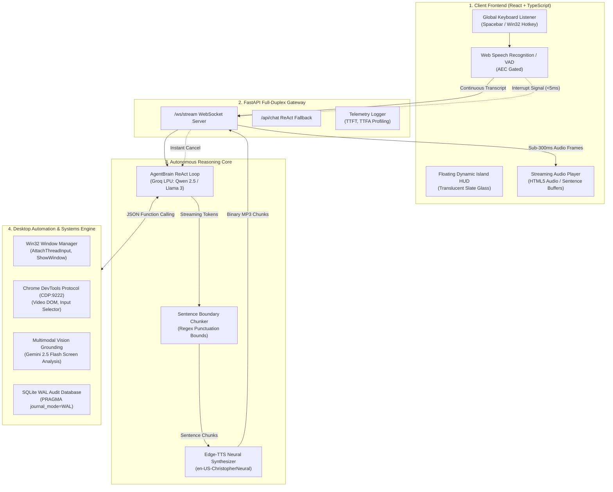

# 🎙️ Autonomous Voice Agent with Desktop Automation

> **Production-Grade, Full-Duplex Voice AI Agent & Operating System Automation Engine**  
> Engineered from first principles with an asynchronous event-driven loop in Python (FastAPI + WebSockets), React + TypeScript Dynamic HUD, native Win32 window management, and Chrome DevTools Protocol (CDP) in-tab execution.

[](https://www.python.org/downloads/)
[](https://fastapi.tiangolo.com/)
[](https://react.dev/)
[](https://www.typescriptlang.org/)
[](LICENSE)
[]()

---

## 📌 Executive Summary

**Autonomous Voice Agent with Desktop Automation** is an enterprise-grade full-duplex conversational voice system and desktop automation pipeline. It replaces fragile, blocking CLI assistants with an ultra-low latency, bidirectional streaming voice interface coupled with native operating system and browser execution.

Unlike standard voice wrappers that rely on heavy orchestration frameworks (LangChain, Vapi, or LiveKit), this project is implemented from first principles in pure Python `asyncio` and WebSockets. It delivers sub-300ms Time-to-First-Audio (TTFA), instant client-side interruptibility ($<5\text{ms}$ barge-in), deterministic Win32 window management, and in-tab browser execution via the Chrome DevTools Protocol.

---

## 🔬 Core Voice AI Physics & Architecture

### The Voice Agent Equation
A production voice agent is an asynchronous, event-driven cascade of distinct subsystems:

$$\text{Voice Agent} = \text{Audio Streaming Buffer} + \text{VAD Turn Taker} + \text{STT Engine} + \underbrace{\text{LLM Agent Loop (Tools + Memory)}}_{\text{The Brain}} + \text{TTS Synthesizer}$$

### The TTFA Latency Breakdown
Conversational voice feels sluggish when latency exceeds $1.0\text{s}$. The Time-to-First-Audio budget is governed by:

$$\text{TTFA} = T_{\text{VAD Hangover}} + T_{\text{Network RTT}} + T_{\text{STT Transcribe}} + T_{\text{LLM First Token}} + T_{\text{TTS First Chunk}}$$

To achieve **sub-300ms perceived TTFA**, this system implements **Sentence-Level Pipelining**: the LLM token stream is evaluated through an adaptive punctuation chunker, dispatching the first complete clause to neural voice synthesis immediately while subsequent reasoning tokens generate in parallel.

---

## 🏗️ Master Architectural Diagram



---

## ⚡ Key Technical Features & Implementations

### 1. Instant Barge-In (<5ms Interruption Handling)
In natural dialogue, humans interrupt. When user speech is detected during assistant playback:
- **Client Audio Purge:** The frontend immediately halts playback and clears active audio buffers.
- **Server Task Cancellation:** A WebSocket frame (`{"type": "interrupt"}`) is dispatched, instantly aborting running LLM generation and Edge-TTS synthesis tasks via `asyncio.Event`.
- **Memory Reconciliation:** Unspoken tokens are pruned from conversation history so conversational memory strictly reflects what the user actually heard.

### 2. Acoustic Echo Cancellation (AEC) Gating
When audio plays through laptop speakers, the microphone can capture the assistant's own voice. The pipeline employs dynamic VAD probability threshold elevation during playback, preventing self-interruption loops and false triggers.

### 3. Window State Awareness & Non-Duplicate Process Reuse
- Solves macro typing failures by resolving target windows through title keywords and Win32 APIs (`GetForegroundWindow`, `AttachThreadInput`, `ShowWindow`).
- **Calculator State Intelligence:** Reuses an already-running Calculator window rather than spawning duplicate `calc.exe` processes. Clears prior results with `Escape` before typing new calculations.

### 4. Mathematical Expression Vocalization
Converts mathematical operators into natural spoken English (`*` $\rightarrow$ `times`, `+` $\rightarrow$ `plus`, `-` $\rightarrow$ `minus`, `/` $\rightarrow$ `divided by`, `=` $\rightarrow$ `equals`) prior to TTS markdown sanitization. Asking *"Calculate 20 times 10"* announces:
> *"Calculated 20 times 10 equals 200 in Calculator, Sir."*

### 5. In-Tab Chrome Control via CDP (Chrome DevTools Protocol)
- Operates over port 9222 directly within active Chrome browser tabs.
- Manipulates HTML5 video elements (`pause`, `play`, `mute`, `seek`), clicks top search results, and fills form inputs without brittle coordinate guesswork.
- Includes automatic fallback to Windows native media keys if CDP is inactive.

### 6. Multimodal Screen Grounding (Vision AI)
- Uses Gemini 2.5 Flash to analyze active monitor displays in under 1 second.
- Provides visual element localization, returning precise $(x, y)$ coordinates to guide automated mouse clicks for visual targets.

### 7. Minimalist Titanium Slate Studio HUD
- Built with React 19 and TypeScript, styled with a refined slate titanium palette (`#1c202a` / `#212632`) and frosted glass (`backdrop-filter: blur(28px)`).
- **On-Demand Vitals:** CPU and RAM metrics are queried strictly when explicitly requested by voice, eliminating background polling overhead.

---

## 📁 Repository Directory Structure

```text
Autonomous-Voice-Agent-with-Desktop-Automation/
├── api/
│   ├── app.py                     # FastAPI server, REST routes & Full-Duplex WebSockets
│   └── __init__.py
├── core/
│   ├── config.py                  # Audio parameters, model definitions, thresholds
│   ├── state.py                   # Multi-turn conversation state & interrupt handling
│   └── telemetry.py               # Latency profiler (TTFT, TTFA, STT, Turn profiling)
├── database/
│   ├── db.py                      # SQLite WAL engine & parameterized queries
│   └── schema.sql                 # Audit logs, telemetry records & metrics tables
├── frontend/                      # React 19 + TypeScript Dynamic HUD
│   ├── src/
│   │   ├── App.tsx                # Floating island HUD, audio queue & hotkey listener
│   │   ├── App.css                # Minimalist titanium slate studio theme
│   │   ├── index.css              # Typography & system design tokens
│   │   └── main.tsx               # Client entry point
│   ├── package.json               # Node dependencies & Vite scripts
│   └── vite.config.ts             # Vite configuration
├── pipeline/
│   ├── chunker.py                 # Adaptive punctuation sentence boundary chunker
│   └── orchestrator.py            # Local audio cascade loop (sounddevice + Silero VAD)
├── services/
│   ├── brain.py                   # Autonomous ReAct agent loop with Groq LPU
│   ├── stt.py                     # Whisper Large v3 Turbo transcription
│   ├── tts.py                     # Edge-TTS WebSocket audio synthesis & math cleaner
│   └── vad.py                     # Silero VAD v5 ONNX neural state machine
├── tests/
│   ├── test_api.py                # API & tool endpoint validation
│   ├── test_db.py                 # SQLite WAL transaction tests
│   ├── test_os_tools.py           # Window discovery, CDP, and OS tool tests
│   └── test_sentence_chunker.py   # Sentence boundary streaming tests
├── tools/
│   ├── cdp_controller.py          # Chrome DevTools Protocol client (port 9222)
│   ├── db_tools.py                # Safe read-only SQLite interrogation
│   ├── file_tools.py              # Launchers, folders, URLs, calculator typing
│   ├── schemas.py                 # OpenAI/Groq function calling JSON schemas
│   ├── system_tools.py            # psutil OS metrics & process enumeration
│   ├── vision_grounding.py        # Gemini 2.5 Flash screen analysis & coordinates
│   ├── window_manager.py          # Win32 foregrounding & AttachThreadInput
│   └── __init__.py                # Tool registry and dispatcher
├── main.py                        # Backend application entry point (uvicorn)
├── requirements.txt               # Backend Python dependencies
├── LICENSE                        # MIT License
└── tray_agent.py                  # Windows system tray companion (Ctrl+Shift+Space)
```

---

## 🛠️ Tool Registry & Schemas

| Tool Name | Domain | Execution Mechanism | Purpose |
| :--- | :--- | :--- | :--- |
| `focus_window` | Desktop OS | Win32 API (`AttachThreadInput`) | Brings target window into foreground focus. |
| `desktop_type_or_calculate` | Desktop OS | Win32 + PyAutoGUI + Python eval | Reuses Calculator instance, types expression, and vocalizes the result. |
| `control_chrome_tab_video` | Browser (CDP) | Chrome DevTools Protocol | Controls in-tab HTML5 video (`pause`, `play`, `mute`) with media key fallback. |
| `click_chrome_element` | Browser (CDP) | Chrome DevTools Protocol | Clicks top search results or specific DOM selectors. |
| `search_web_or_play` | Web / YouTube | URL routing + regex video scraping | Resolves search queries and launches direct YouTube watch links. |
| `open_folder_or_path` | File System | Windows Explorer / Pathlib | Locates and opens user folders across Desktop, Documents, and Downloads. |
| `open_application` | OS Apps | Shell execution + StartApps | Universal launcher for installed software (VS Code, Chrome, WhatsApp, etc.). |
| `capture_and_analyze_screen` | Multimodal | PyAutoGUI + Gemini 2.5 Flash | Inspects and describes the active desktop display. |
| `click_on_visual_target` | Multimodal | Vision AI Grounding + PyAutoGUI | Identifies $(x, y)$ coordinates of visual UI elements and executes clicks. |
| `get_system_vitals` | OS Diagnostics | `psutil` (On-Demand) | Inspects CPU %, RAM, and Disk C free space when requested. |
| `get_top_processes` | OS Diagnostics | `psutil` (On-Demand) | Enumerates highest memory or CPU consuming processes. |
| `query_local_db` | SQLite WAL | Parameterized SQL | Read-only SQL interrogation of conversation audit logs. |

---

## 🚀 Getting Started

### 1. Prerequisites
- **Operating System:** Windows 10/11
- **Python:** 3.11+
- **Node.js:** 18+

### 2. Installation

Clone the repository and install backend requirements:
```powershell
git clone https://github.com/Nikil-R/Autonomous-Voice-Agent-with-Desktop-Automation.git
cd Autonomous-Voice-Agent-with-Desktop-Automation
pip install -r requirements.txt
```

Install frontend dependencies:
```powershell
cd frontend
npm install
cd ..
```

### 3. Environment Variables
Create a `.env` file in the root directory:
```env
GROQ_API_KEY=gsk_your_groq_api_key_here
GEMINI_API_KEY=AIzaSy_your_gemini_api_key_here
```

---

## 💻 Running the Application

### Development Server Workflow

**Terminal 1 — FastAPI Backend (Auto-reloading):**
```powershell
uvicorn main:app --reload
```

**Terminal 2 — React TypeScript HUD:**
```powershell
cd frontend
npm run dev
```

Navigate to `http://localhost:5173`. Press <kbd>SPACE</kbd> or click the status icon to activate voice automation.

### Windows System Tray Companion
To run the agent as a background Windows notification tray app with a global shortcut:
```powershell
python tray_agent.py
```
*Press <kbd>Ctrl</kbd> + <kbd>Shift</kbd> + <kbd>Space</kbd> anywhere in Windows to toggle the floating HUD.*

---

## 🧪 Verification & Automated Testing

All modules are covered by automated unit tests verifying database transactions, OS tools, and streaming sentence boundary chunking:

```powershell
# Run backend test suite
python -m pytest -v tests/

# Verify frontend build & TypeScript compliance
cd frontend
npm run build
```

---

## 🎙️ Example Voice Prompts

| Intent | Voice Command | System Behavior |
| :--- | :--- | :--- |
| **Calculation** | *"Calculate 20 times 10"* | Focuses existing Calculator, clears prior calculation, types `20*10=`, and speaks: *"Calculated 20 times 10 equals 200 in Calculator, Sir."* |
| **Window Switching** | *"Bring Chrome to the front"* | Finds active Google Chrome window and brings it to foreground focus. |
| **Media Playback** | *"Play Jailer 2 song on YouTube"* | Scrapes and plays the top song directly in Chrome. |
| **Video Control** | *"Pause the video"* | Dispatches CDP video control to pause active HTML5 playback. |
| **Screen Inspection** | *"What is currently on my screen?"* | Captures screenshot and describes active windows via Gemini 2.5 Flash. |
| **Folder Access** | *"Open my Studies folder"* | Searches Desktop and Documents to launch the folder in Windows Explorer. |
| **Hardware Vitals** | *"What is my CPU usage right now?"* | Queries `psutil` on-demand and announces CPU usage. |

---

## 🛡️ Security & Reliability Architecture

- **ACID Database Safety:** SQLite operates with `PRAGMA journal_mode=WAL` (Write-Ahead Logging) and `PRAGMA synchronous=NORMAL`, preventing database locks during concurrent reads and writes.
- **SQL Injection Prevention:** `query_local_db` blocks all mutating statements (`INSERT`, `UPDATE`, `DELETE`, `DROP`), enforcing strictly read-only execution.
- **Path Traversal Containment:** File scanning operations strictly validate target directories against user-owned boundaries (`Desktop`, `Documents`, `Downloads`).
- **Fail-Safe PyAutoGUI Handling:** GUI operations handle corner fail-safes gracefully without crashing the running ReAct loop.

---

## 📄 License

This project is licensed under the [MIT License](LICENSE).
