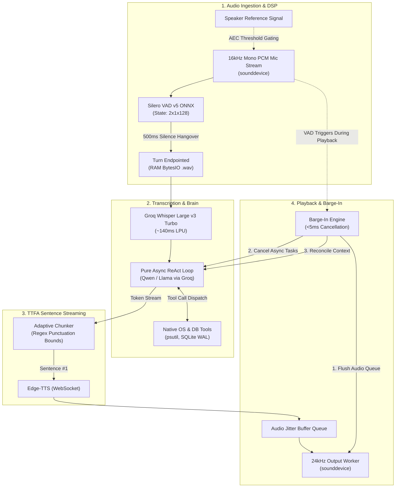

# 🚀 ApexCore: Autonomous Full-Duplex Voice AI Agent

**ApexCore** is a production-grade, framework-free desktop voice AI agent engineered with an asynchronous event loop in pure Python. It combines local digital audio signal processing, neural turn-taking, fast LPU cloud cognitive inference, and operating system / database intelligence.

---

## 🏗️ Master Architectural Diagram



---

## ⚡ Key Engineering Highlights

1. **Zero Framework Dependencies:** No LangChain, Vapi, or LiveKit abstractions. Built entirely on `asyncio`, standard socket protocols, and direct low-level libraries.
2. **Sub-500ms TTFA Sentence Streaming:** LLM tokens are buffered through an adaptive sentence chunker, sending Sentence #1 to neural TTS immediately while Sentence #2 is being generated.
3. **Hardware-to-Database Concurrency:** Real-time operating system telemetry inspection (`psutil`), desktop execution (`subprocess`), and ACID SQLite transactions in WAL mode (`PRAGMA journal_mode=WAL`).
4. **Real-Time Full-Duplex Barge-In:** When the human speaks during assistant playback, generation tasks are cancelled in $<5\text{ms}$, the speaker buffer is flushed, and conversational memory is reconciled.
5. **Acoustic Echo Gating:** Elevates the Silero VAD probability threshold dynamically during active playback to prevent audio feedback loops.

---

## 📁 Repository Directory Structure

```text
ApexCore/
├── .env                              # API keys (GROQ_API_KEY, GEMINI_API_KEY)
├── .gitignore                        # Git exclusion rules
├── requirements.txt                  # Python dependencies
├── run.py                            # CLI entry point launcher
├── PLAN.md                           # Master architectural blueprint
│
├── core/
│   ├── config.py                     # Sample rates, model IDs, thresholds, file paths
│   ├── state.py                      # Multi-turn context & Barge-In memory reconciliation
│   └── telemetry.py                  # Millisecond latency profiler (TTFT, TTFA, STT, VAD)
│
├── database/
│   ├── schema.sql                    # System metrics history & audit event tables
│   └── db.py                         # SQLite engine in WAL mode with connection management
│
├── tools/
│   ├── schemas.py                    # OpenAI/Groq function calling JSON schemas
│   ├── system_tools.py               # get_system_vitals(), get_top_processes()
│   ├── file_tools.py                 # search_files(), open_application()
│   ├── db_tools.py                   # query_local_db() safe read-only SQL
│   └── __init__.py                   # Tool registry and dispatcher
│
├── services/
│   ├── vad.py                        # Silero VAD ONNX recurrent state machine wrapper
│   ├── stt.py                        # Whisper Large v3 Turbo in-memory WAV transcription
│   ├── tts.py                        # Edge-TTS streaming synthesis service
│   └── brain.py                      # Async ReAct loop with streaming token output
│
├── pipeline/
│   ├── chunker.py                    # Adaptive sentence boundary chunker (TTFA optimizer)
│   └── orchestrator.py               # Master full-duplex loop: VAD -> STT -> Brain -> TTS
│
├── benchmarks/
│   └── compare_engines.py            # Automated latency benchmark: Cascade vs Multimodal
│
├── models/
│   └── silero_vad.onnx               # Silero VAD neural network model (~2.3MB)
│
└── tests/
    ├── test_os_tools.py              # Unit tests for system vitals & process inspection
    ├── test_db.py                    # Unit tests for SQLite WAL mode & query security
    └── test_sentence_chunker.py      # Unit tests for sentence boundary chunking
```

---

## 🚀 Getting Started

### 1. Prerequisites
Ensure Python 3.11+ is installed. Install all project dependencies:
```bash
pip install -r requirements.txt
```

### 2. Configure Environment
Set your API key in `.env`:
```ini
GROQ_API_KEY=gsk_your_groq_api_key_here
```

### 3. Run Automated Unit Tests
```bash
python -m pytest -v tests/
```

### 4. Run the Engine Comparison Benchmark
```bash
python benchmarks/compare_engines.py
```

### 5. Launch ApexCore Voice Agent
```bash
python run.py
```
